### Relational Databases and SQL
A relational database stores information in a structured format called a schema. This schema is defined according to the rules or database normalization. These rules are meant to ensure the integrity of the data. 
While SQL is a query language that allows users to filter, manipulate , or update data on a database.

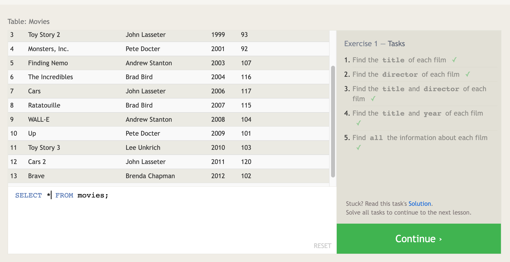

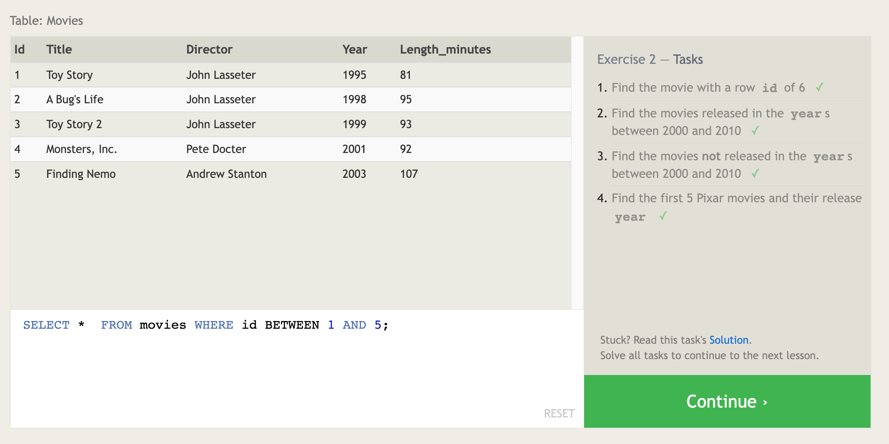

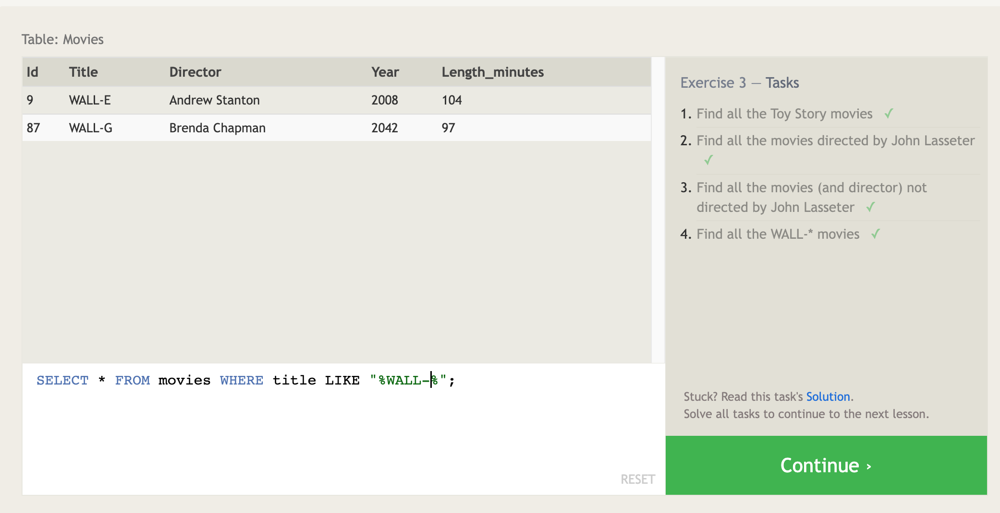

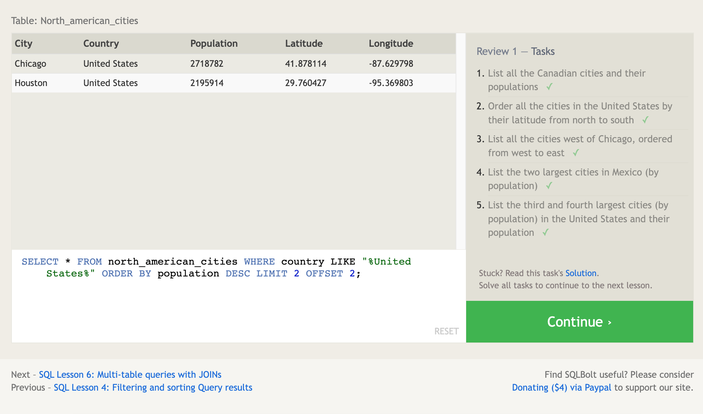

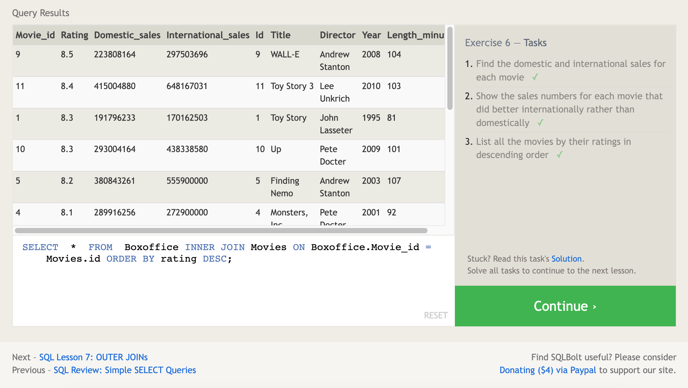

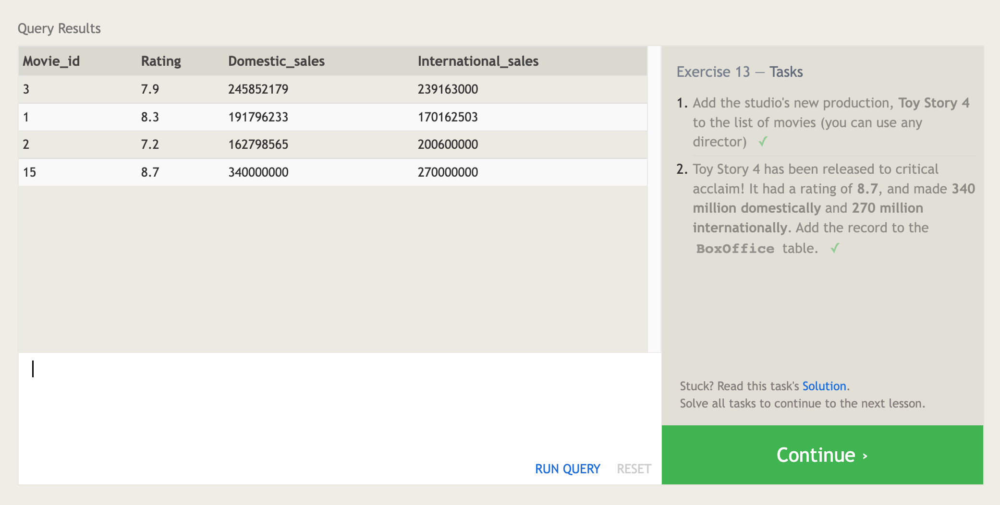

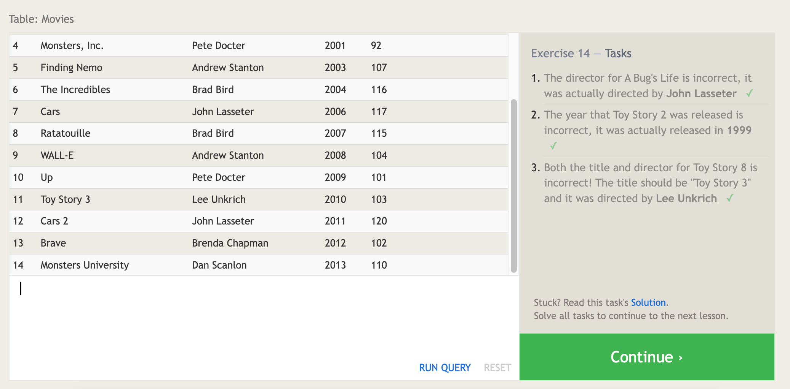

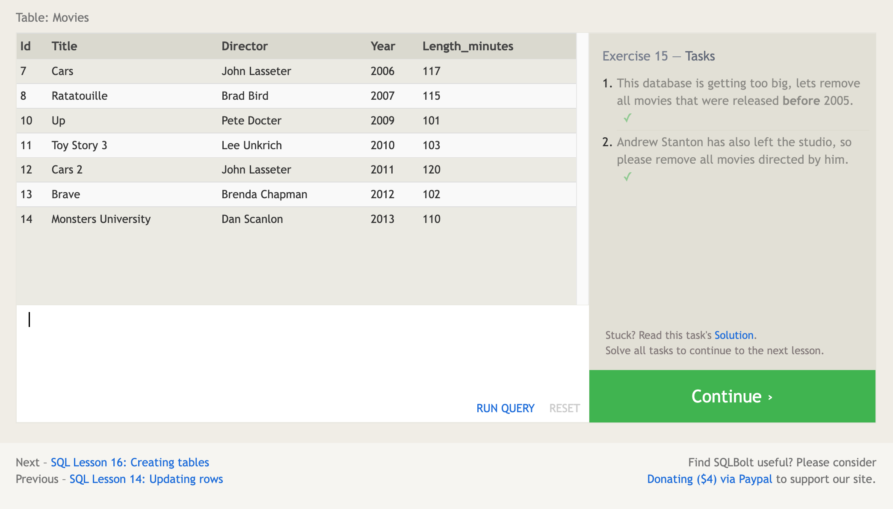

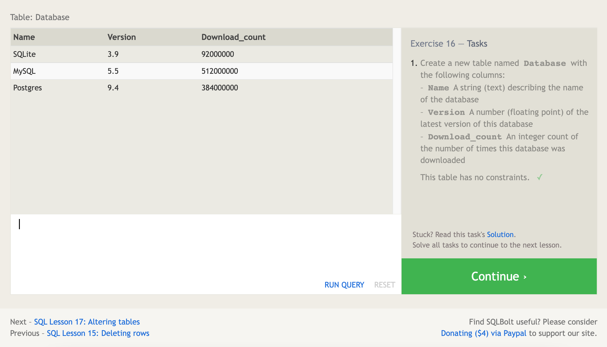

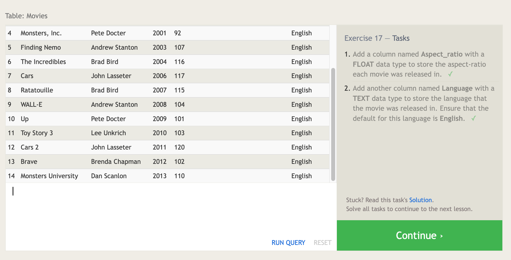

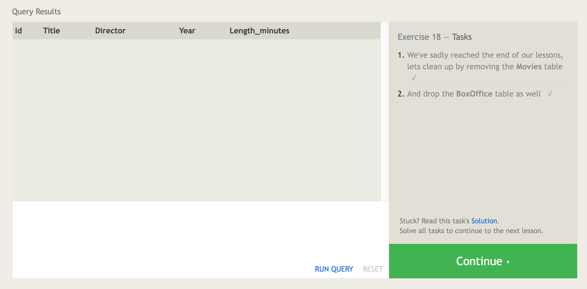
